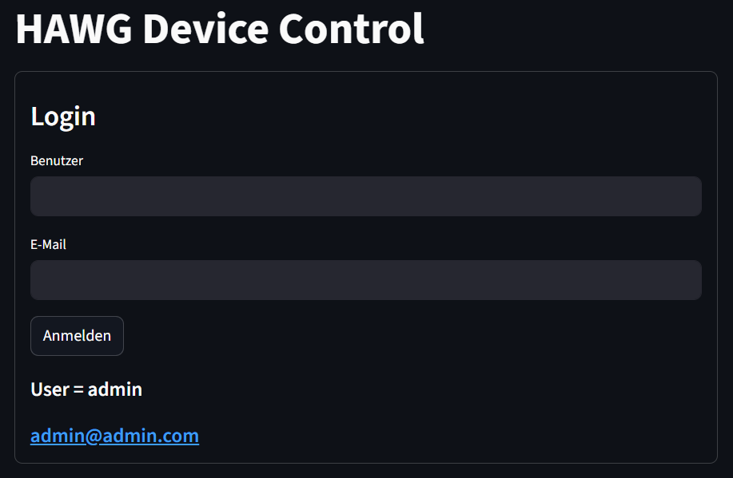
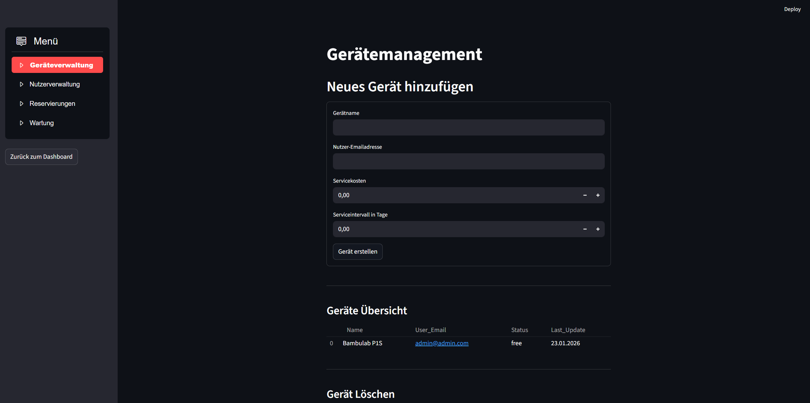
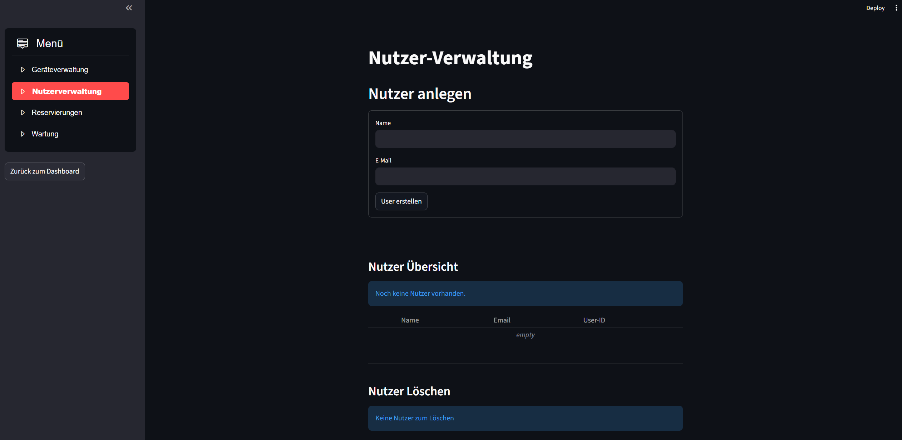

# Case_Study_1 (HAWG Device Control)

Für dieses Assignment mussten wir eine Software zu entwickeln, mit der Geräte (z.B. Laser-Cutter, 3D-Drucker, etc.) an einer Hochschule verwaltet werden können.

## Installation: 

Mittels den folgenden Befehl können alle benötigten Pakete installiert werden. Dieser Vorgang kann mehrere Minuten in Anspruch nehmen. Bitte installieren Sie es in Ihrer .venv.

````bash
 python -m pip install -r requirements.txt
````

Nach der Installation können Sie mit dem folgeden Befehl das Dashboard öffnen und Ihre Geräte verwalten.

````bash
streamlit run main.py
````

## Dashboard: 

Das Dashboard zum Stand von 19.12.2025 also vor der Deadline des ersten Assignments finden Sie unter diesem [Link](https://drive.google.com/drive/folders/1aZwUw87IfQMBrL1t-ImaTXJyoQ_oWbUH?usp=drive_link)

Am 29.12.2025 gab es eine große Erweiterung zum Dashboard. Im folgendem finden Sie das Dasboard in der neuesten Version:

### Loginfenster:



### Admin Dashboard


### Geräteverwaltung



### Nutzerverwaltung

